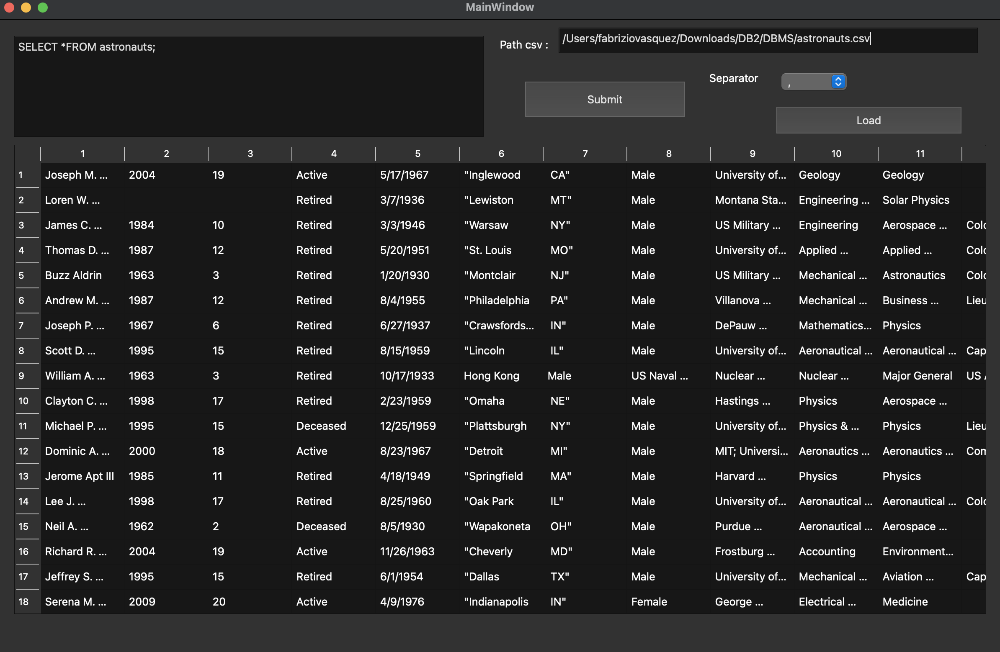
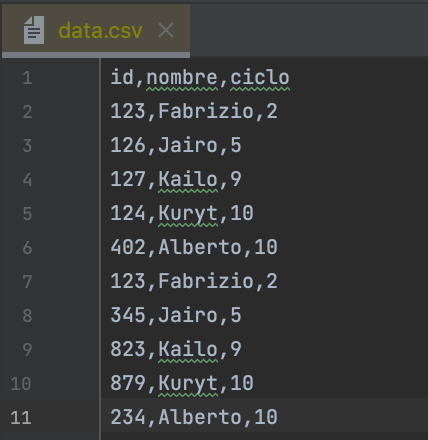
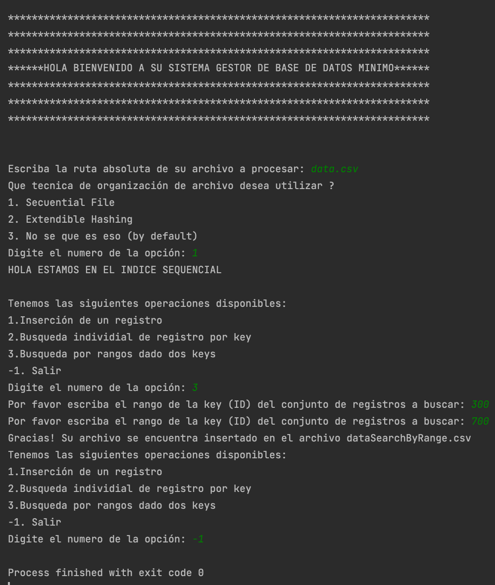
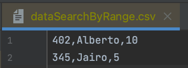

# 

  <h1>Proyecto 1 - Base de datos II </h1>

Integrantes
- Jean Miraval
- Fabrizio Vásquez
- Mateo Noel

# Tabla de contenido

- [Introducción](#Introducción)
    - [Objetivo del proyecto](#Objetivo-del-proyecto)
    - [Resultados que se esperan obtener](#Resultados-que-se-esperan-obtener)
- [Fundamente y describa las técnicas](#Fundamente-y-describa-las-técnicas)
    - [Explicación procedimental del proceso de inserción, eliminacióny búsqueda](#Explínimoicación-procedimental-del-proceso-de-inserción,-eliminación-y-búsqueda)
    - [Aspectos importantes de la implementación de dichas técnicas](#Aspectos-importantes-de-la-implementación-de-dichas-técnicas)
- [Resultados Experimentales](#Resultados-Experimentales)
- [Pruebas de uso de la aplicación](#Pruebas-de-uso-de-la-aplicación)
    - [Aspectos importantes de la implementación de dichas técnicas](#Aspectos-importantes-de-la-implementación-de-dichas-técnicas)
    - [Video de uso de la aplicación](#Video-de-uso-de-la-aplicación)

# Introducción

## Objetivos del proyecto
- Aprender a utilizar memoria secundaria.
- Entender las aplicaciones del uso de memoria secundaria.
- Comprender las diferentes técnicas de organización de archivos.
- Crear un sistema gestor de base de datos minimo. 
- SGBD mínimo posea operaciones inserción, busqueda, busqueda por rango y eliminación.

## Resultados que se esperan obtener
- Esperamos obtener registros o conjunto de registros en base a las consultas que se realizaremos.
- Conseguir un rendimiento promedio en la ejecución de las consultas.

## Fundamente y describa las técnicas
Las técnicas utilizadas para estructurar la base de datos son SequentialFile y Extendible Hashing.

Extendible hashing es un hash dinámico que reduce y aumenta su tamaño dependiendo de que y cuantos valores hay dentro de este. La función hash genera una secuencia de bits,a partir de esta los registros se almacenan en buckets dependiendo del key.

## Explicación procedimental del proceso de inserción, eliminacióny búsqueda
Sequantial File
- Inserción: Primero, localizas donde se inserta el nuevo registro. Si el espacio está libre, insertas. Sino insertas en el espacio auxiliar y actualizas punteros.
- Búsqueda: Se realiza una búsqueda binaria.

Extendible hashing
Donde D es la profundidad global del índice.
- Inserción: Primero se localiza el bucket en donde se debe insertar. Si encontró bucket y no está lleno, inserta.  Si el bucket esta lleno, dividir el bucket, creando nuevos con mayor profundidad y reinsertar todos los registros que estaban en este bucket. Si no se puede incrementar la profundidad se produce desbordamiento de buckets. Por otro lado, si no encontró bucket, buscas el de profundidad local mínima, y si no hay, creas el bucket e insertas el elemento en este.

Búsqueda:
Aplicar la función hash sobre la clave de búsqueda y obtener la secuencia D-bit. 
Se busca el valor binario donde pertenecería el key a buscar y dependiendo de este nos dirigimos al bucket correspondiente. Se va buscando primero el valor binario completo y se va acortando hasta que coincida con el valor del bucket ya que estos se construyen a partir del prefijo.

## Aspectos importantes de la implementación de dichas técnicas

# Resultados Experimentales

# Pruebas de uso de la aplicación
Como incialmente se tenía previsto trabajar con QT creator para la parte de la interfaz gráfica del SGBD minimo, los retornos de las funciones de insercion y busqueda retornaban archivos .csv para que QT creator las mostrará al usuario; sin embargo no se logro vincular QT, ya que se no se reconocía los archivos generados por nuestro  programa por lo que se construyo de manera provisional un menu en la consola al ejecutar directamente archivo main.cpp.

 
  

Provisional

Dataset basico

 
  

Menu provisional

 
  

Resultado de consulta Busqueda por rangos

 
  

## Aspectos importantes de la implementación de dichas técnicas

## Video de uso de la aplicación

